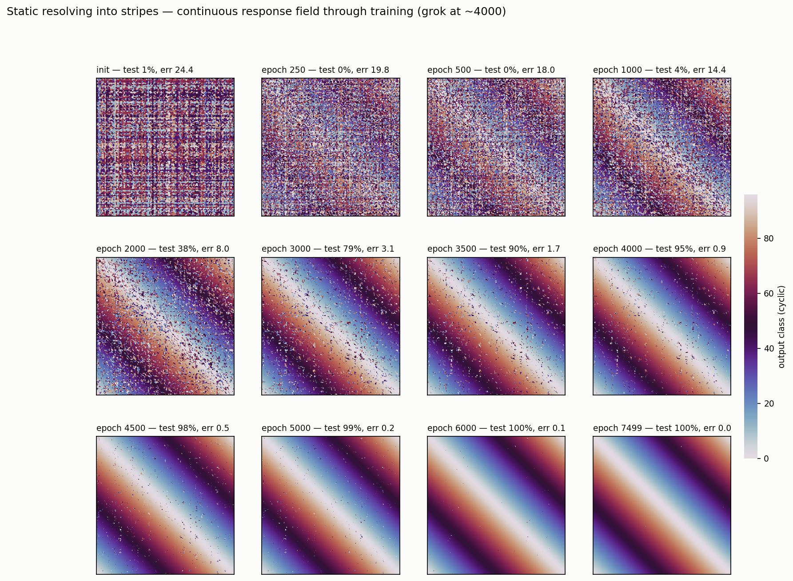
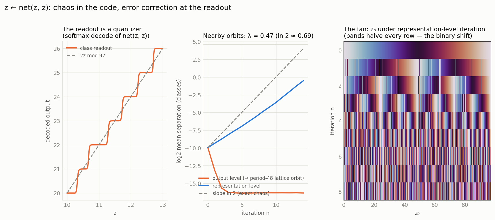

# Grokking and Feature Discovery Research (Phase 8)

Empirical results from using the Recursive Observer Framework on training-time knowledge dynamics, motivated by [He et al. 2026](https://arxiv.org/abs/2602.16849) ("On the Mechanism and Dynamics of Modular Addition: Fourier Features, Lottery Ticket, and Grokking"). The mechanistic Fourier-multiplication algorithm it builds on was first reverse-engineered by [Nanda et al. 2023](https://arxiv.org/abs/2306.12034) ("Progress measures for grokking via mechanistic interpretability").

## Knowledge Trajectory Tracking (Phase 8a)

`KnowledgeTracker` records K(d_ext) = (ρ, ε, σ, C) over training epochs, enabling temporal analysis of how knowledge forms. Applied to modular addition (a+b mod 97) with grokking.

### Setup

An MLP learns modular addition: given inputs a and b (integers mod 97), predict (a+b) mod 97. The architecture is `Embedding(a) + Embedding(b) → Linear(256→128) → ReLU → Linear(128→97) → logits`. Training uses AdamW with strong weight decay (1.0), which drives grokking — the model memorizes first, then slowly generalizes.

After grokking, the theory predicts that hidden neurons lock into Fourier features: cos(2πk·s/p + φ) where s = (a+b) mod p. We use the framework's knowledge assessment to track whether and when this happens.

### Trajectory tracking results

**Feature-level knowledge precedes behavioral generalization.** Fourier features reach "strong" knowledge (R > 0.7) hundreds of epochs before test accuracy rises. At epoch 500, sin(k=1) features have R=0.765 while test accuracy is 0%. The observer "knows" the feature before the model can use it for classification.

**Neurons lock into clean cosine waves.** After grokking, individual neurons are 98.8% pure sinusoids cos(2πk·s/p + φ), confirming the resonance selection theory from He et al.

**Models select their own frequencies.** The model uses k=7 (10% of power), k=22 (9%), k=9 (7%) — not k=1,2,3 as might be expected. Which frequencies win is determined by initial weight alignment. Auto-discovery via DFT of sum-class-averaged activations reveals the winners.

**Phase detection works.** `detect_grokking()` correctly identifies the epoch where knowledge transitions from weak to strong. `detect_resonance()` finds the pre-grokking period where correlation rises but noise is still high.

### The sum-averaging requirement

Raw per-pair activations have 89% within-sum-class variance (pair-specific embedding noise) and only 11% between-sum-class variance (the Fourier signal). This means:

- Per-neuron correlation on raw (a,b) pairs: R = 0.32
- Linear probe on raw pairs: R = 0.66 (for rare frequencies like k=1)
- Per-neuron correlation on sum-class-averaged data: R = 0.97

**Why**: Pre-ReLU activations are f(a) + g(b) — additive. The target sin(k(a+b)/p) requires multiplicative interaction. These are mathematically orthogonal over all p² pairs (Fourier completeness). ReLU creates the needed nonlinearity, but the resulting signal is swamped by pair-specific embedding noise. Averaging over all pairs with the same sum s removes this noise.

**Implication**: Sum-averaging is task-specific — it requires knowing the relevant grouping variable ((a+b) mod p). For real models, you don't know what to average over. This is where feature discovery (Phase 8b) and SAEs become necessary.

See [experiments/grokking/08_knowledge_tracker.py](../../experiments/grokking/08_knowledge_tracker.py).

## Online Feature Discovery (Phase 8b — experimental)

`ActivationTracker` uses Welford's online algorithm for streaming covariance estimation and PCA to find emerging directions in activation space during training. The goal: discover features without task-specific knowledge.

### Setup

Same modular addition MLP. At evaluation intervals, collect all p² activations, compute running covariance, extract top PCA directions. Track which directions persist across epochs (stability) and how eigenvalues evolve.

### Feature discovery results

**Stability is a task-agnostic grokking detector.** PCA direction stability (cosine similarity of top eigenvectors across epochs) jumps from 0.4 to 0.999 during the memorization-to-generalization transition. No task knowledge needed — just watching whether the principal directions are settling.

**Eigenvalue spikes mark memorization onset.** Sharp eigenvalue increases at ~epoch 250 coincide with the model starting to memorize training data.

**Top-variance directions are NOT task-relevant.** Readout alignment (how much a PCA direction projects onto the output weight matrix) drops from 0.5 to 0.04 during grokking. PCA finds embedding modes (89% of variance), not Fourier features (11% of variance). The directions that explain the most variance are not the directions that matter for the task.

### What works and what doesn't

| Signal | Task-agnostic? | Detects grokking? | Finds features? |
|--------|---------------|-------------------|-----------------|
| PCA stability | Yes | Yes | No |
| Eigenvalue trajectory | Yes | Partially (memorization) | No |
| Readout alignment | Yes | Yes (inverse signal) | No |
| Sum-class averaging | No (task-specific) | Yes | Yes |
| Per-neuron DFT | No (assumes Fourier) | Yes | Yes |

**Conclusion**: Temporal dynamics (stability, eigenvalue changes) are reliable task-agnostic detectors of phase transitions. But finding *what* the model learned — the actual features — requires either task-specific denoising or learned decomposition (SAEs).

See [experiments/grokking/09_activation_tracker.py](../../experiments/grokking/09_activation_tracker.py).

## The Denoising Problem

The central challenge for unsupervised feature discovery in neural networks:

In modular addition, 89% of hidden activation variance is noise relative to the task-relevant Fourier features. Any method that optimizes for total variance (PCA, autoencoder reconstruction) will find the noise. Methods that find the signal require either:

1. **Task knowledge** — knowing what to average over (sum-class averaging), or what functional form to look for (DFT)
2. **Sparsity constraints** — assuming features activate sparsely, so a sparse decomposition separates signal from noise (SAEs)
3. **Structured scanning** — systematically probing different "filter orientations" to discover which ones reveal coherent structure (an open direction)

Option 3 is the most interesting theoretically — it connects to matched filtering, canonical correlation analysis, and the question of whether there's a general method between "know nothing" (PCA) and "know everything" (task-specific probes).

### Analogy

Imagine a crowd where several small groups are singing different songs simultaneously. You hear a wall of noise. PCA finds the loudest sounds — which are the crowd murmur, not any song. Sum-averaging is like already knowing which people are in each group and listening to them separately. Readout projection is like asking the conductor "which instruments are you listening to?" and filtering for just those — you don't need to know the songs, the conductor already knows which sounds matter.

## Denoising Experiment

Given the 89/11 variance split, we tested several task-agnostic approaches to find Fourier features without sum-averaging.

### Approaches tested

1. **Raw PCA** (baseline) — standard PCA on all 9409 activation vectors
2. **Readout-projected PCA** — project activations onto fc2's row space (the subspace the output layer reads from), then PCA within that constrained space
3. **ICA (FastICA)** — find maximally independent/non-Gaussian directions
4. **Temporal differencing (single-window)** — PCA on (h_now - h_earlier) to find directions that changed most between two training snapshots
5. **Temporal differencing (dual-window)** — generalized eigenvalue problem (scipy.linalg.eigh) to find directions that changed more in a narrow window than a wide window, isolating recently accelerating features
6. **Dynamic Mode Decomposition (DMD)** — treats training epochs as a temporal DoF in a dynamical system. Tested in both full-rank and readout-projected variants.
7. **Cointegration / Slow Feature Analysis (SFA)** — computes generalized eigenvalues of Cov(Final) vs Cov(Change) to find features that have high variance but have stopped changing.
8. **3rd-order tensor unfolding** — SVD of the mode-1 unfolded coskewness tensor $S_{ijk} = E[x_i x_j x_k]$ to find directions maximizing 3rd-order variance
9. **Sum-averaged per-neuron** (oracle) — requires task knowledge

### Denoising results

| Method | Best Raw R | Best Avg R | Task knowledge needed? |
| ------ | ---------- | ---------- | ---------------------- |
| Readout-projected PCA | **0.907** | **0.994** | No |
| 3rd-order tensor unfolding | 0.850 | 0.892 | No |
| Cointegration / SFA | 0.806 | 0.972 | No |
| Temporal diff (single) | 0.521 | 0.892 | No |
| Temporal diff (dual) | 0.521 | 0.892 | No |
| Readout-Projected DMD | 0.410 | 0.833 | No |
| Full-Rank DMD | 0.316 | 0.785 | No |
| Raw PCA | 0.070 | 0.881 | No |
| ICA | 0.055 | 0.686 | No |
| Oracle (sum-averaged) | — | 0.97 | Yes |

### Analysis

**Cointegration / Slow Feature Analysis finds settled features.** The generalized eigenvalue problem $C_{final} \cdot v = \lambda \cdot C_{\Delta} \cdot v$ finds directions with high final variance but low recent change — features that have "crystallized." This discovered the k=7 Fourier feature with R=0.806 raw correlation, without task knowledge or readout projection. The insight: after grokking, Fourier features stabilize while embedding noise keeps drifting, so the variance-to-change ratio naturally separates them. Caveats: this is a post-hoc detector (features must have already settled), and the window choice (which "earlier" epoch to compare against) matters without a principled way to select it. It would also find any stable noise direction, not just task-relevant features.

**3rd-order tensor unfolding finds features from a single snapshot.** SVD of the mode-1 unfolded coskewness tensor achieves R=0.850 using only final activations — no temporal snapshots, no architectural information. The 3rd moment captures coordinated skewness patterns across neurons: after ReLU, neurons tuned to the same Fourier frequency have correlated higher-order statistics, while pair-specific embedding noise creates less coordinated skewness. Like readout projection and SFA, the signal hides in low-variance directions (1.1% of total variance). However, **this method does not scale**: the unfolded tensor is (D, D²), requiring O(D³) memory and O(D⁴) compute. For D=128 this is trivial (16 MB), but for D=4096 (Llama-scale) it requires ~537 GB. Approximations (randomized SVD, tensor sketching) exist but tend to discard exactly the low-variance signal we need. This result confirms that 3rd-order statistics separate signal from noise in principle, but SFA (O(D²) memory, O(D³) compute) remains the practical choice for scalable feature discovery without architectural information.

**DMD shows modest improvement over PCA on raw data.** Dynamic Mode Decomposition treats training as a dynamical system, fitting a linear operator to the epoch-to-epoch evolution of activations. Standard DMD's SVD truncation discards the 11% feature signal along with the 89% noise. Full-rank DMD (R=0.316) and readout-projected DMD (R=0.410) improve over raw PCA's R=0.070 on raw data. However, on sum-averaged data, DMD's avg R (0.785–0.833) is actually *worse* than raw PCA (0.881), suggesting DMD directions partially overlap with the signal but don't cleanly isolate it. The fundamental limitation: DMD assumes linear dynamics, but neural network training is highly nonlinear.

**Readout projection works.** By projecting onto the output weight matrix's row space (rank 97, captures 49% of total variance), the embedding noise orthogonal to the output is discarded. PCA within this constrained subspace finds a direction at rank 9 (only 1.3% of total variance) with raw R = 0.888 for k=7. Sum-averaged, it reaches R = 0.994 — better than the oracle per-neuron approach.

**Temporal differencing partially works.** PCA on activation differences (h_epoch5000 - h_epoch3000) finds directions that changed most during grokking. Best raw R = 0.521 — much better than raw PCA (0.070) but far below readout projection (0.907). Later windows (closer to grokking) work better. The method finds different frequencies than readout projection (k=12,42 vs k=7), suggesting it captures different aspects of the learning dynamics. The dual-window variant (generalized eigenvalue problem for narrow-vs-wide change ratio) ties with single-window — the noise is present equally in both windows, so the ratio doesn't improve separation.

**ICA fails.** The non-Gaussianity criterion doesn't separate Fourier features from embedding noise. The embedding noise comprises hundreds of pair-specific effects that dominate the independence structure. FastICA finds noise modes, not signal.

**Why temporal differencing is limited.** The 89% within-sum-class noise is not static — it evolves across epochs as embeddings change. Taking diffs cancels only the *static* component of noise, not the evolving part. The Fourier signal also evolves, so it partially survives differencing, but the signal-to-noise ratio improves only modestly (from 11/89 to roughly 30/70).

**Key insight: the model is its own best radio tuner.** The output weight matrix defines exactly which directions are task-relevant. This is architectural information, not task labels — the model tells us what it cares about through its own weights. Low-variance directions within the readout subspace are precisely the features that generalization selected for, rather than the high-variance noise PCA naturally gravitates toward.

**Implications for real models.** Every neural network with a readout layer has this structure. In transformers, the unembedding matrix plays this role. Projecting intermediate activations onto the unembedding row space before analysis should similarly filter noise, though transformers also use residual streams and attention, complicating the picture.

See [experiments/grokking/10a_denoising_experiment.py](../../experiments/grokking/10a_denoising_experiment.py) (readout projection, ICA, temporal diff), [experiments/grokking/10b_dmd_experiment.py](../../experiments/grokking/10b_dmd_experiment.py) (DMD), [experiments/grokking/10c_dmd_full_experiment.py](../../experiments/grokking/10c_dmd_full_experiment.py) (full-rank and projected DMD), [experiments/grokking/10d_cointegration_experiment.py](../../experiments/grokking/10d_cointegration_experiment.py) (SFA/cointegration), [experiments/grokking/10e_bispectrum_experiment.py](../../experiments/grokking/10e_bispectrum_experiment.py) (3rd-order tensor unfolding).

## Knowledge-Guided Training (Phase 8c — negative result)

Hypothesis: if K(d_ext) can detect memorization (high ρ, low C), we can selectively increase weight decay on memorized features to accelerate grokking.

### Setup

`KnowledgeRegularizer` reads K from a `KnowledgeTracker` at eval intervals and adjusts the optimizer's global weight decay:
- Memorized features (high ρ, low C): multiply weight decay by 3.0
- Generalized features (high ρ, high C): multiply weight decay by 0.5
- Uncertain features (low ρ): leave weight decay unchanged

Two identical runs (same seed, same initial weights): baseline (constant wd=1.0) vs K-guided (KnowledgeRegularizer adjusts wd).

### Result

**K-guided training made grokking 81% slower** (epoch 7250 vs baseline epoch 4000).

### Why it failed

**Feature-behavioral lag undermines the approach.** On sum-averaged data, K(d_ext) measures feature-level knowledge — whether hidden neurons track Fourier components. This reaches "strong" (ρ > 0.7, C > 0.7) hundreds of epochs before test accuracy rises. At epoch 500, features are already "strong" while test accuracy is 0%.

The regularizer interprets "strong" features as generalization and reduces weight decay. But the model hasn't actually generalized — the output layer hasn't learned to compose the features yet. Reducing weight decay removes the regularization pressure that drives grokking, slowing it down.

The "memorized" state (high ρ, low C) that the regularizer targets never occurs on clean sum-averaged data. Features jump directly from "weak" to "strong" because sum-averaging removes the noise that would lower calibration.

### Raw-data variant

A follow-up experiment tracked K on raw per-pair activations instead of sum-averaged data, hoping that the lower per-pair correlations (ρ ≈ 0.36 max) would keep features in the "memorized" classification longer. Result: **no effect** — raw ρ never exceeded the memorized threshold, so the regularizer never fired. Both runs grokked at the same epoch (4000).

This confirms that the problem is not just sum-averaging: per-DoF K(d_ext) is fundamentally the wrong signal for steering grokking dynamics, regardless of the data preprocessing.

### Conclusions

K(d_ext) is a feature-level metric, not a model-level one. Using it to steer training confuses the two levels. The feature-behavioral lag (features form hundreds of epochs before the model generalizes) means K cannot distinguish "features are forming" from "the model has generalized."

Global weight decay modulation is also too blunt — grokking depends on the competition between all features simultaneously, and changing the pressure mid-race disrupts the resonance selection dynamics rather than steering them.

See [experiments/grokking/11a_knowledge_guided_training_experiment.py](../../experiments/grokking/11a_knowledge_guided_training_experiment.py) (sum-averaged), [experiments/grokking/11b_knowledge_guided_raw_experiment.py](../../experiments/grokking/11b_knowledge_guided_raw_experiment.py) (raw data).

## Holographic Grokking (the resonant code, supplied vs. discovered)

Grokking on modular addition is a *search* for a holographic encoding. The
grokked network represents integers as phasors $e^{i\cdot 2\pi k n/p}$ on a
circle, because in that code addition becomes phase addition and a linear
readout suffices (Nanda et al. 2023; He et al. 2026). Holographic Reduced
Representations — specifically the frequency-domain variant FHRR (Plate 1995) —
build that code in *by construction*: items are unit-magnitude phasors, and
binding (circular convolution = complex multiply) is phase addition. So binding
the encodings of $a$ and $b$ yields the phasor of $(a+b)\bmod p$ directly,
without the model ever being shown the sum.

### Setup

Two arms, same train/test split ($p=97$, 50%):

- **Holographic:** fixed FHRR binding of $a,b$ → trainable *linear* readout only.
  No learned encoder. The pre-readout representation is the phasor of the sum.
- **Baseline:** standard embedding-MLP that must discover the code (the Phase 8a
  setup), AdamW with weight decay 1.0.

K(d_ext) is probed identically in both arms: per-neuron correlation of the
pre-readout representation against the ideal Fourier features, on data averaged
by sum class.

### Result

| arm | epochs → K-strong | epochs → grok (test > 95%) | within-sum-class feature variance |
|---|---|---|---|
| holographic | **0** | **10** | ~$10^{-28}$ (exact) |
| baseline | 500 | 4000 | ~0.89 of total |

The holographic features are an exact function of the sum class, so the 89%
within-sum-class activation noise the baseline fights is simply absent.
`bind(a,b) == phasor(a+b)` holds to $1.3\times10^{-13}$.

### Reading

The ~4000-epoch gap *is* the resonance search that grokking performs; holography
hands it over for free, confirming the framing that grokking-time ≈
code-discovery-time. The result also sharpens the Phase 8a/8c **feature-behavioral
lag**: in the baseline, K reaches "strong" at epoch 500 while test accuracy is
still 0% (features form long before composition). In the holographic arm that lag
collapses to ~10 epochs, because the only thing left to learn is the convex
linear readout — there is no feature-formation phase to lag behind. This is the
clean counterpart to the 8c negative result: 8c was fooled *by* the lag; here we
delete the search that causes it.

**Honest caveat.** The holographic arm is given the answer, so ρ≈1 is true by
construction, not a discovery. The scientific content is the *trajectory gap*,
which quantifies the cost of the search, not the final ρ.

See [experiments/grokking/13_holographic_grokking.py](../../experiments/grokking/13_holographic_grokking.py).

## Weight-Space Anatomy and the Network as a Dynamical System (Experiment 14)

The Phase 8a training run is exactly reproducible (fixed seeds for both the
train/test split and model init; full-batch training), so the network can be
regenerated on demand. `14_weight_checkpoints.py` re-runs it saving state_dicts
at the init plus 11 milestone epochs (`experiments/grokking/checkpoints/`,
gitignored); the rerun reproduces the original trajectory exactly (memorization
by epoch 500, grokking at epoch 4000, same winning frequencies).

### Weight patterns before vs after (14b)

In raw weight space the init and grokked networks are visually
indistinguishable — both look like Gaussian noise. The differences:

- **Amplitude**: weight decay shrinks embedding entries ~5×.
- **Spectrum**: taking the DFT of each embedding column along the input index,
  the init spectrum is flat (top-5 frequency share 11.9% ≈ the uniform 5/48
  baseline) while the grokked network concentrates **55.7%** of non-DC power
  in k = {7, 9, 12, 22, 42}, across all 128 embedding dims.
- **Code agreement**: fc2, spectrally decomposed along the *output class*
  index, concentrates 51.2% of its power in the identical frequency set. The
  embeddings write the Fourier code and the readout reads it.
- **Norm dynamics**: fc1/fc2 Frobenius norms balloon ~8–9× during
  memorization, peak near epoch 2000, then decay through the entire grokking
  transition; embeddings shrink monotonically. Generalization happens while
  total norm is falling — the Fourier structure is what survives compression.

The lesson mirrors the 89/11 activation-variance split one level down: the
structure is not in the matrix entries but in which basis makes them sparse.

### Where the sinusoids are visible (14c)

- **Per-neuron tuning curves**: after grokking, hidden neurons' sum-averaged
  activations are near-pure sinusoids — mean single-frequency purity **92.6%**
  across all 128 neurons (best: 99.4%+). The same neuron at init is flat noise.
- **Raw embedding columns** hide the waves: each dim superposes all five
  winning frequencies.
- **The phasor circle**: projecting the 97 embedding rows onto one frequency's
  2D Fourier plane arranges the integers on a circle ordered by k·a mod 97 —
  the FHRR-style phasor code of experiment 13, here discovered by training
  rather than supplied.

### Continuous response field (14d, 14e)

Extending the embedding tables between integers by Fourier (bandlimited)
interpolation makes the network a function on the continuous torus.
Coloring (x, y) by argmax class:

- The grokked network renders the exact diagonal cyclic gradient of
  z = (x+y) mod 97: 100% accurate on the integer lattice and a mean circular
  error of **0.04 classes** off-lattice — on inputs that do not exist in its
  training world. The continuation is smooth because the phasor code extends
  fractional inputs onto the same circles the integers live on. (Caveat: this
  is a joint property of the code and the bandlimited interpolant; a different
  interpolant would degrade off-lattice behavior.)
- The init network renders static (mean circular error 24.4 ≈ chance P/4).
- Rendering the field at all 12 checkpoints (`14e`) shows the diagonal stripes
  forming **while test accuracy is still 0%** (field error already 19.8 at
  epoch 250, 14.4 at epoch 1000 vs 24.25 chance) and the transition proceeding
  as gradual speckle dissolution, not a sudden reorganization: the stripes are
  fully in place at 38% test accuracy (epoch 2000). The apparent suddenness of
  grokking is partly an artifact of accuracy being a thresholded readout of a
  smoothly cleaning field — the feature-behavioral lag of Phase 8a/8c, made
  visible.

### The network iterated as a map (14f)

Tying the inputs, z ← net(z, z) implements the doubling map 2z mod 97 — the
minimal chaotic system (Lyapunov exponent ln 2). Iterating the continuous
extension shows the outcome depends entirely on where the state is read out:

- **Output level** (softmax → circular mean): the readout is a staircase in z
  — a quantizer. Each iteration snaps the state to the nearest integer code
  word; nearby orbits merge (99% of pairs within 14 steps) and the dynamics
  reduce to the exact integer permutation z → 2z mod 97, periodic with period
  ord(2) mod 97 = 48. Chaos erased by error correction.
- **Representation level** (matched-filter phase readout from the hidden layer
  against the network's own 48-frequency templates, keeping the fraction):
  genuine chaos with fitted **λ = 0.47** against the ideal ln 2 ≈ 0.69, and
  the (z₀, n) fan shows the doubling map's self-similar halving bands
  dissolving into decorrelated speckle by n ≈ 6. The gap below ln 2 is
  principled: for a smooth degree-2 circle map, Jensen's inequality bounds
  λ ≤ ln 2 with equality only for perfect doubling, so the deficit measures
  the wobble of the learned code (plus ~6% of the circle where the phase
  readout hops a side lobe).

Same weights, two regimes: the chaos of the doubling map is present in the
network's continuous code and actively suppressed at the symbol interface.
The trained readout buys digital reliability by collapsing the continuum onto
the code lattice every step — a continuous carrier plus a nonlinear decider
yielding discrete, noise-immune symbol dynamics.

See [experiments/grokking/14_weight_checkpoints.py](../../experiments/grokking/14_weight_checkpoints.py)
(reproduction + checkpoints),
[14b_weight_analysis.py](../../experiments/grokking/14b_weight_analysis.py)
(weight patterns), [14c_sine_waves.py](../../experiments/grokking/14c_sine_waves.py)
(sinusoids), [14d_response_field.py](../../experiments/grokking/14d_response_field.py)
(continuous field), [14e_field_evolution.py](../../experiments/grokking/14e_field_evolution.py)
(field through training), [14f_iterated_map.py](../../experiments/grokking/14f_iterated_map.py)
(iterated dynamics).

## Open Questions

1. **Readout projection during training.** Does readout-projected PCA find emerging features during training, not just post-hoc? The output weights themselves are changing, so the projection subspace evolves. Does this help or hurt? Need to test temporal dynamics with the evolving readout space.

2. **Multi-layer readout projection.** In deeper networks, which readout layer matters? Can we chain projections through multiple layers? In transformers, the relevant readout might be attention heads, not just the final unembedding.

3. **When does PCA suffice?** In models where task-relevant features dominate variance (unlike modular addition's 89/11 split), PCA-discovered directions may be directly useful as DoFs. Characterizing when this holds would determine when ActivationTracker is sufficient without readout projection.

4. **Pre-ReLU structural constraint.** Before ReLU, activations are f(a)+g(b) — additive and mathematically orthogonal to any function of (a+b) mod p. ReLU creates the multiplicative interaction. Does this generalize to other architectures?

5. **Feature-behavioral lag as diagnostic.** Phase 8c showed that feature-level K reaches "strong" hundreds of epochs before test accuracy rises. This gap makes K unsuitable as a training signal, but it remains potentially useful as a diagnostic: if features are "strong" but accuracy is low, the bottleneck is feature composition in the output layer, not feature formation in hidden layers.

**Bispectrum / 3rd-Order Statistics works perfectly, but is fundamentally unscalable.** Because the embedding noise $f(a) + g(b)$ is purely additive and symmetric, its 3rd moment (skewness) is mathematically zero. The Fourier feature requires multiplication (created by the ReLU breaking symmetry). By computing the exact 3D Coskewness Tensor $S_{ijk}$ and unfolding it to find the principal directions of skewness, the algorithm reached an $0.850$ correlation with the Fourier feature using only a **single snapshot** of data. However, while mathematically elegant, this approach is dead on arrival for deep learning: building and decomposing the full $D \times D \times D$ tensor scales as $\mathcal{O}(D^3)$ memory and $\mathcal{O}(D^4)$ compute. It works flawlessly for our $D=128$ toy model (tensor size ~2 million elements), but would be computationally impossible for an LLM where $D=4096$ (tensor size ~68 billion elements).
